# OASIS Map - ウェルビーイングを実現するための、地域の協調的幸福度の可視化プラットフォーム

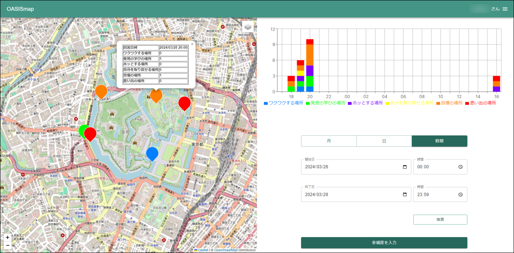

## 目次

- [OASIS Map - ウェルビーイングを実現するための、地域の協調的幸福度の可視化プラットフォーム](#oasis-map---ウェルビーイングを実現するための地域の協調的幸福度の可視化プラットフォーム)
  - [目次](#目次)
  - [本プロジェクトについて](#本プロジェクトについて)
  - [OASIS Mapの始め方 クイックスタート](#oasis-mapの始め方-クイックスタート)
    - [概要](#概要)
    - [インストール方法](#インストール方法)
    - [基本的な使い方](#基本的な使い方)
      - [自治体管理者向け](#自治体管理者向け)
      - [利用者向け](#利用者向け)
      - [アプリケーション停止方法](#アプリケーション停止方法)
  - [利用バージョン](#利用バージョン)
  - [ライセンス](#ライセンス)

## 本プロジェクトについて

基盤ソフトウェア「[FIWARE (ファイウェア)](https://www.fiware.org/)」を用いて、地域の協調的幸福度を可視化するプラットフォーム

## OASIS Mapの始め方 クイックスタート

### 概要

- `docker compose`で提供しております
- `docker compose 2.21.0`, `docker 24.0.7` をインストール済みの `Ubuntu 22.04.3` 上で動作確認しております
- またインストールの中で `curl` を使用しております
- 対応ブラウザ
  - Chrome
  - Safari

### インストール方法

1. git clone

    ```sh
    git clone git@github.com:c-3lab/oasismap.git
    ```

2. 作業ディレクトリに移動

    ```sh
    cd oasismap
    ```

3. MongoDBとPostgreSQLのユーザー、パスワードおよび地図の初期パラメータ値(緯度、経度、ズーム値)、KeyCloakの設定を.envに設定

    ```sh
    ~/oasismap$ cp _env .env
    ~/oasismap$ vi .env
    ```

    ※以下の環境変数は後ほど設定
      - `KC_HOSTNAME_URL`
      - `KC_HOSTNAME_ADMIN_URL`
      - `KEYCLOAK_CLIENT_ISSUER`
      - `GENERAL_USER_KEYCLOAK_CLIENT_SECRET`
      - `ADMIN_KEYCLOAK_CLIENT_SECRET`

4. ngrokのアカウントを登録する  
    https://ngrok.com/

5. 手順に従いngrokをインストールする  
    https://ngrok.com/docs/getting-started/

6. ngrok起動

    ```sh
    ~/oasismap$ ngrok http 8080
    ```

    ```sh
    Try the new Traffic Inspector dev preview: https://ngrok.com/r/ti                                   
                                                                                                        
    Session Status                online                                                                
    Account                       アカウント名 (Plan: Free)                                            
    Version                       3.6.0                                                                 
    Region                        Japan (jp)                                                            
    Latency                       5ms                                                                   
    Web Interface                 http://127.0.0.1:4040                                                 
    Forwarding                    https://xxxx-xxx-xxx-x-xx.ngrok-free.app -> http://localhost:8080     
                                                                                                        
    Connections                   ttl     opn     rt1     rt5     p50     p90                           
                                  1224    0       0.00    0.01    0.06    6.29                          
                                                                                                        
    HTTP Requests                                                                                       
    ```

7. `Forwarding` から https:// で始まるURLを取得する

8. 環境変数 `KC_HOSTNAME_URL` `KC_HOSTNAME_ADMIN_URL` `KEYCLOAK_CLIENT_ISSUER` に上記のURLを設定する

    ```sh
    KC_HOSTNAME_URL=https://xxxx-xxx-xxx-x-xx.ngrok-free.app
    KC_HOSTNAME_ADMIN_URL=https://xxxx-xxx-xxx-x-xx.ngrok-free.app
    KEYCLOAK_CLIENT_ISSUER=https://xxxx-xxx-xxx-x-xx.ngrok-free.app/realms/oasismap
    ```

9. Dockerコンテナを展開

    ```sh
    ~/oasismap$ docker compose up -d
    ```

### 位置情報の利用について

OASIS Mapでは現在の位置情報を利用します。  
但し `http` で動作させた場合は実際の位置情報ではなく、仮の位置情報が使われます。  
実際の位置情報を利用する場合は、Keycloakの他にOASIS Map本体も `https` で動作させる必要があります。  
手順は [現在位置情報を利用した動作確認手順](doc/location-usage-verification.md) を確認してください。

仮の位置情報で問題ない場合は本手順はスキップしてください。

### Google Cloud 事前準備

1. [Google Cloud](https://console.cloud.google.com/apis/credentials)に接続
2. `プロジェクトを選択` から新しいプロジェクトを作成
3. `認証情報を作成` を選択して `OAuth クライアント ID` を作成
4. アプリケーションの種類に `ウェブアプリケーション` を選択して作成
5. クライアントID、シークレットを `keycloak/variables.json` の `GoogleClientID` `GoogleClientSecret` に転記

### Keycloak 自動設定

1. keycloakディレクトリに移動

    ```sh
    cd keycloak
    ```

2. `formatting-variables.sh` を実行して都道府県名/市区町村名の情報を `variables.json` に設定

    ```sh
    ~/keycloak$ bash formatting-variables.sh cities.json
    ```

3. 自動設定スクリプトで利用する環境変数を設定

    ```sh
    ~/keycloak$ export KEYCLOAK_ADMIN={.envで指定した管理者ユーザー名}
    ~/keycloak$ export KEYCLOAK_ADMIN_PASSWORD={.envで指定した管理者ユーザーのパスワード}
    ```

4. keycloakディレクトリのパスを取得

    ```sh
    ~/keycloak$ pwd
    ```

5. 以下のコマンドを実行  
    ※ 4で取得したkeycloakディレクトリのパスに書き換えて実行すること

    ```sh
    ~/keycloak$ docker run --network oasismap_backend-network --volume {keycloakディレクトリのパス}:/etc/newman/keycloak \
    postman/newman:latest run --bail --environment /etc/newman/keycloak/variables.json \
    --env-var "KeycloakAdminUser=$KEYCLOAK_ADMIN" \
    --env-var "KeycloakAdminPassword=$KEYCLOAK_ADMIN_PASSWORD" \
    /etc/newman/keycloak/postman-collection.json
    ```

### 環境変数の準備と追加

1. ブラウザから `http://Dockerホスト名:8080`でアクセスします。
2. 「Administration Console」をクリック
3. 環境変数 `KEYCLOAK_ADMIN` `KEYCLOAK_ADMIN_PASSWORD` に指定した認証情報でログイン

#### Google CloudにリダイレクトURIを設定

1. `realm` から `oasismap` を選択
2. 左のメニューバーから `Identity providers` を選択
3. `google` をクリック
4. `Redirect URI` の値をコピーして控えておく
5. [Google Cloud](https://console.cloud.google.com/apis/credentials)に接続
6. 事前準備にて作成した認証情報を選択
7. `承認済みのリダイレクトURI` に控えておいた `Redirect URI` を転記して保存

#### 利用者向けクライアントシークレットの設定

1. `realm` から `oasismap` を選択
2. 左のメニューバーから `client` をクリック
3. `general-user-client` をクリック
4. `Credentials` をクリック
5. `Client Secret` の値を環境変数 `GENERAL_USER_KEYCLOAK_CLIENT_SECRET` に転記

#### 自治体管理者向けクライアントシークレットの設定

1. `realm` に `oasismap` を選択
2. 左のメニューバーから `client` をクリック
3. `admin-client` をクリック
4. `Credentials` をクリック
5. `Client Secret` の値を環境変数 `ADMIN_KEYCLOAK_CLIENT_SECRET` に転記

#### コンテナを再起動して環境変数を反映させる

```sh
~/oasismap$ docker compose up -d frontend
```

### orionにサブスクリプション設定を行う

1. バックエンドのコンテナにはいる

    ```sh
    docker compose -f docker-compose-dev.yml exec backend bash
    ```

2. 以下コマンドを実行してorionにサブスクリプションの設定を行う

    ```sh
    root@backend:/app/backend$ curl -iX POST \
      --url 'http://orion:1026/v2/subscriptions' \
      --header 'content-type: application/json' \
      --header 'Fiware-Service: Government' \
      --header 'Fiware-ServicePath: /Happiness' \
      --data '{
      "description": "Notice of entities change",
      "subject": {
        "entities": [
          {
            "idPattern": ".*",
            "type": "happiness"
          }
        ],
        "condition": {
          "attrs": []
        }
      },
      "notification": {
        "http": {
          "url": "http://cygnus:5055/notify"
        }
      }
    }'
    ```

### 基本的な使い方

#### 自治体管理者向け

##### 自治体管理者アカウントの準備

1. ブラウザから `http://Dockerホスト名:8080` でアクセスします
2. 「Administration Console」をクリック
3. 環境変数 `KEYCLOAK_ADMIN` `KEYCLOAK_ADMIN_PASSWORD` に指定した認証情報でログイン
4. `realm` から `oasismap` を選択
5. 左のメニューバーから `Users` を選択
6. `Add User` を選択
7. `Username`,`profile.attribute.nickname` を入力して `Create` を選択  
    ※ `Username` と `profile.attribute.nickname` は同じ値を入れてください
8. `Credentials` を選択して `Set password` からパスワードを入力してください
9. パスワード入力後, `Temporary` のチェックを外して `Save`
10. `Save password` から保存

##### 自治体管理者機能の使い方

1. ブラウザから `http://Dockerホスト名:3000/admin/login` でアクセスします  
  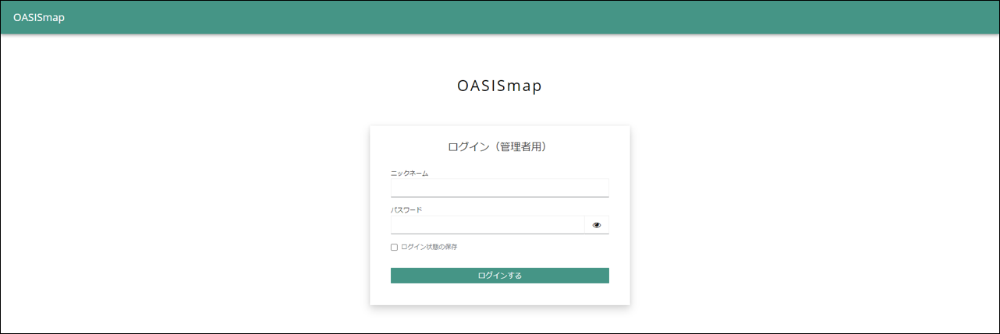  

2. 自治体管理者用アカウントでログインします  
    

3. 右端のハンバーガーメニューの `データエクスポート` から幸福度情報をダウンロードできます  
    

#### 利用者向け

##### ログイン

1. ブラウザから `http://Dockerホスト名:3000` でアクセスします  
  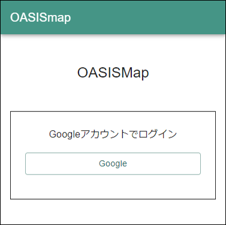  

2. Googleアカウントを用いてログイン  
  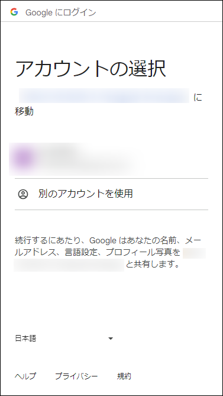  

3. ユーザー情報の入力  
  ※重複するニックネームは登録できません  
  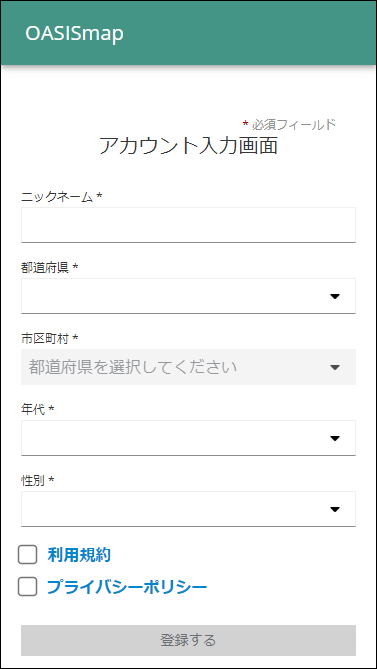  

##### 幸福度の入力

1. 画面下の `幸福度の入力` をクリックします  
  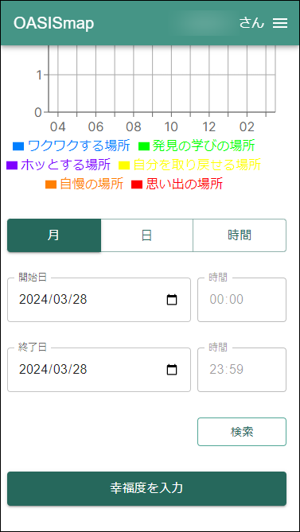  

2. 任意の項目にチェックを入れて `幸福度を送信` をクリックします  
  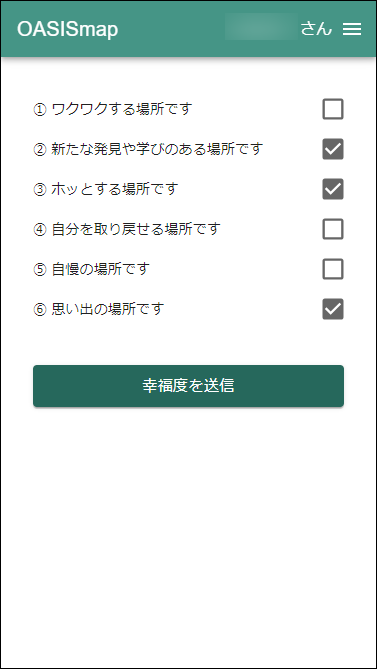  

##### 利用者幸福度の表示
  
1. 右端のハンバーガーメニューをクリックします  
  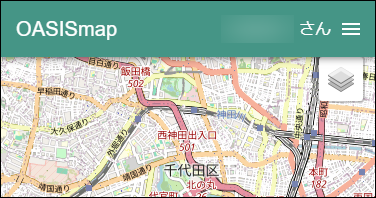  

2. 一覧から `利用者の幸福度` をクリックします  
  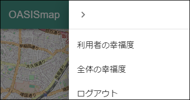  

3. `利用者の幸福度` が地図上とグラフに表示されます  
  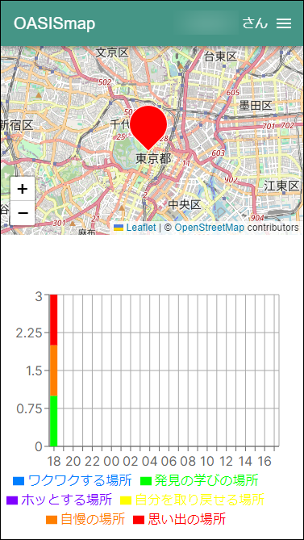  

##### 全体幸福度の表示
  
1. 右端のハンバーガーメニューをクリックします  
    

2. 一覧から `全体の幸福度` をクリックします  
    

3. `全体の幸福度` が地図上とグラフに表示されます  
  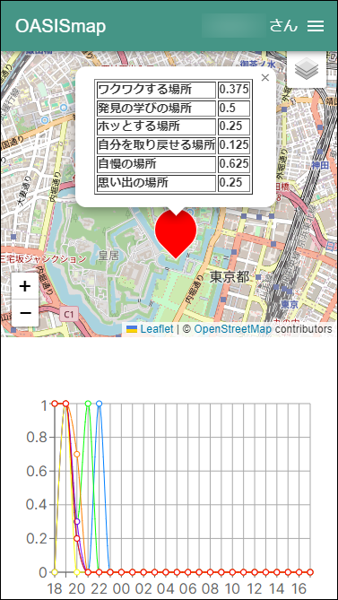  

#### アプリケーション停止方法

- コンテナを停止

  ```sh
  ~/oasismap$ docker compose down
  ```

## 利用バージョン

- [next 14.1.0](https://nextjs.org/)
- [nest 10.0.0](https://nestjs.com/)
- [react 18系](https://ja.reactjs.org/)
- [typescript 5系](https://www.typescriptlang.org/)
- [eslint 8系](https://eslint.org/)
- [prettier 3系](https://prettier.io/)
- [jest 29.5.0](https://jestjs.io/ja/)
- [Postgresql 16.1](https://www.postgresql.org/)
- [FIWARE Cygnus 3.5.0](https://fiware-cygnus.readthedocs.io/en/master/index.html)
- [FIWARE Orion 3.11.0](https://fiware-orion.readthedocs.io/en/master/index.html)
- [mongoDB 6.0.14](https://www.mongodb.com/)
- [node 20.10.0](https://nodejs.org/ja/about/releases/)

## ライセンス

- [AGPL-3.0](LICENSE)
