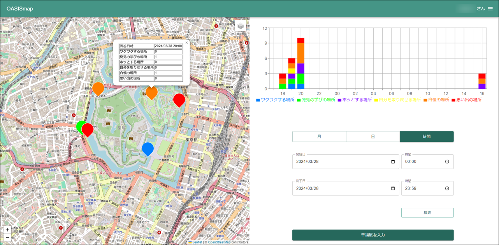
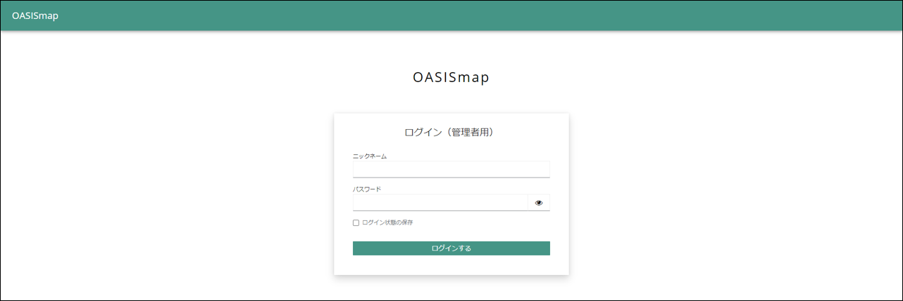
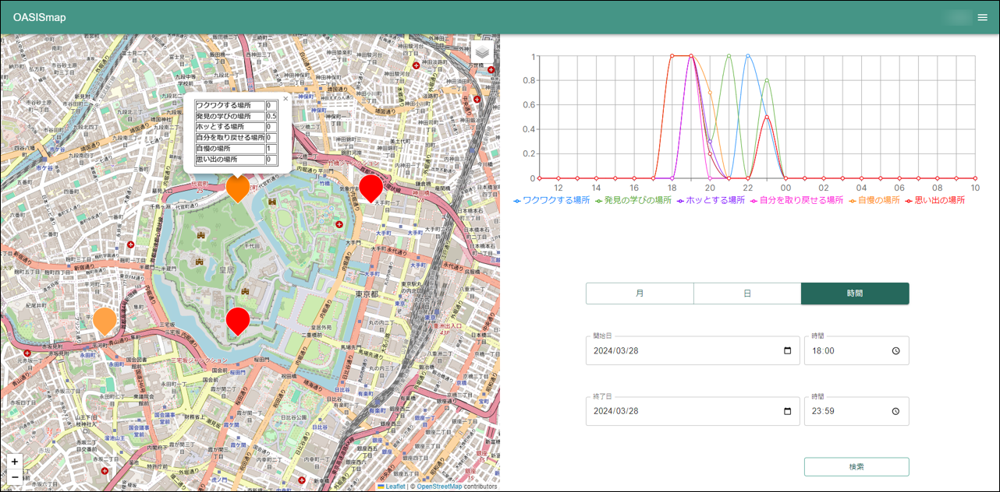
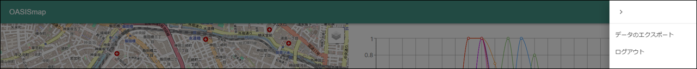
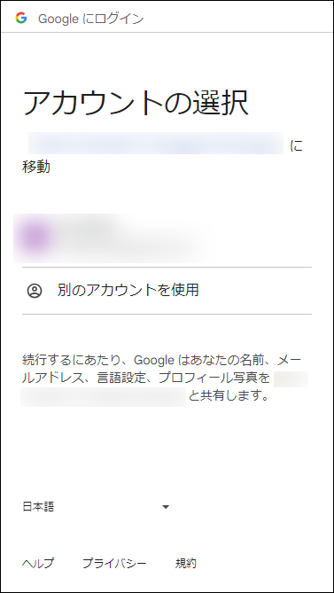
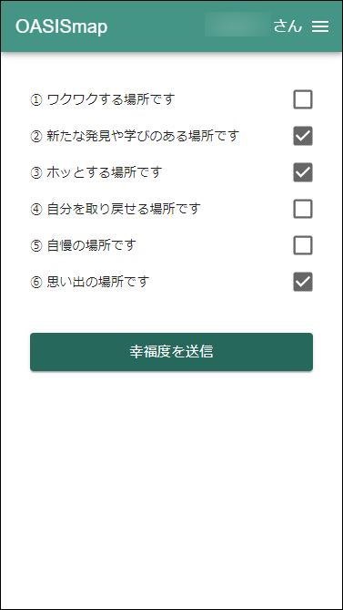
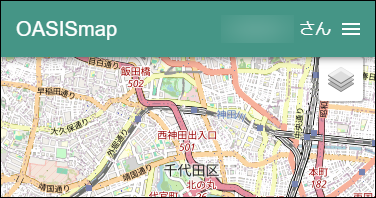
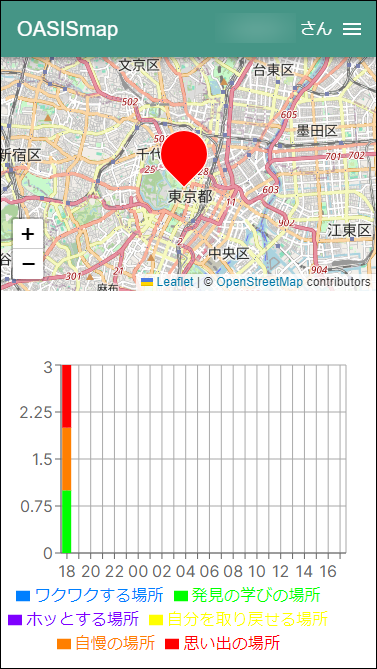
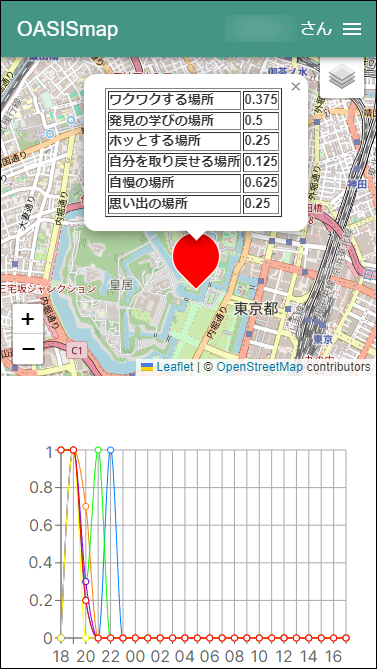

# OASIS Map - ウェルビーイングを実現するための、地域の協調的幸福度の可視化プラットフォーム



## 目次

- [OASIS Map - ウェルビーイングを実現するための、地域の協調的幸福度の可視化プラットフォーム](#oasis-map---ウェルビーイングを実現するための地域の協調的幸福度の可視化プラットフォーム)
  - [目次](#目次)
  - [本プロジェクトについて](#本プロジェクトについて)
  - [OASIS Mapの始め方 クイックスタート](#oasis-mapの始め方-クイックスタート)
    - [概要](#概要)
    - [インストール方法](#インストール方法)
    - [事前準備](#事前準備)
    - [環境変数の定義](#環境変数の定義)
    - [システム起動](#システム起動)
    - [起動後設定](#起動後設定)

  - [基本的な使い方](#基本的な使い方)
    - [自治体管理者向け](#自治体管理者向け)
    - [利用者向け](#利用者向け)
    - [アプリケーション停止方法](#アプリケーション停止方法)
  - [利用バージョン](#利用バージョン)
  - [ライセンス](#ライセンス)

## 本プロジェクトについて

基盤ソフトウェア「[FIWARE (ファイウェア)](https://www.fiware.org/)」を用いて、地域の協調的幸福度を可視化するプラットフォーム

## OASIS Mapの始め方 クイックスタート

### 概要

- `docker compose`で提供しております
- `docker compose 2.21.0`, `docker 24.0.7` をインストール済みの `Ubuntu 22.04.3` 上で動作確認しております
- またインストールの中で `wget` を使用しております
- 対応ブラウザ
  - Chrome
  - Safari

### インストール方法

1. git clone

    ```sh
    git clone git@github.com:c-3lab/oasismap.git
    ```

2. 作業ディレクトリに移動

    ```sh
    cd oasismap
    ```

### 事前準備

#### Google認証を利用しない場合
##### ホストOSのIPアドレスの確認

1. docker上のコンテナから到達可能なホストOSのIPアドレスを確認（ `localhost` や `127.0.0.1` では動作しないことに注意）

    * linux (ネットワークアダプタがeth0の場合)

    ```sh
    ~/oasismap$ ip addr show eth0 | grep "inet\b" | awk '{print $2}' | cut -d/ -f1
    ```
    * macOS（ネットワークアダプタがen0の場合）

    ```sh
    ~/oasismap$ ipconfig getifaddr en0
    ```

#### google認証を利用する場合
##### Google Cloud

1. [Google Cloud](https://console.cloud.google.com/apis/credentials)に接続
2. `プロジェクトを選択` から新しいプロジェクトを作成
3. `認証情報を作成` を選択して `OAuth クライアント ID` を作成
4. アプリケーションの種類に `ウェブアプリケーション` を選択して作成
5. クライアントID、シークレットが記されたjsonをダウンロード（一度しかダウンロードできないので注意）

##### ngrok 事前準備

1. ngrokのアカウントを登録する
    https://ngrok.com/

2. 手順に従いngrokをインストールする
    https://ngrok.com/docs/getting-started/

3. ngrok起動

    ```sh
    ~/oasismap$ ngrok http 8080
    ```

    ```sh
    Try the new Traffic Inspector dev preview: https://ngrok.com/r/ti

    Session Status                online
    Account                       アカウント名 (Plan: Free)
    Version                       3.6.0
    Region                        Japan (jp)
    Latency                       5ms
    Web Interface                 http://127.0.0.1:4040
    Forwarding                    https://xxxx-xxx-xxx-x-xx.ngrok-free.app -> http://localhost:8080

    Connections                   ttl     opn     rt1     rt5     p50     p90
                                  1224    0       0.00    0.01    0.06    6.29

    HTTP Requests
    ```

7. `Forwarding` から https:// で始まるURLを取得する


#### 位置情報の利用について

OASIS Mapでは現在の位置情報を利用します。
但し `http` で動作させた場合は実際の位置情報ではなく、仮の位置情報が使われます。
実際の位置情報を利用する場合は、Keycloakの他にOASIS Map本体も `https` で動作させる必要があります。
手順は [現在位置情報を利用した動作確認手順](doc/location-usage-verification.md) を確認してください。

仮の位置情報で問題ない場合は本手順はスキップしてください。

### 環境変数の定義

1. `_env` をコピーして `.env` を準備します。

    ```sh
    ~/oasismap$ cp _env .env
    ~/oasismap$ vi .env
    ```

2. MongoDBとPostgreSQLのユーザー、パスワードを設定します。

    ```sh
    MONGOUSERNAME=example
    MONGOPASSWORD=CHANGE_TO_RANDOM_STRING
    POSTGREUSER=example
    POSTGREPASSWORD=CHANGE_TO_RANDOM_STRING
    ```

3. 必要に応じて地図の初期パラメータ値(緯度、経度、ズーム値)を設定します。

4. Keycloakのパラメータを設定します。
    * keycloakの管理者ユーザー名（`KEYCLOAK_ADMIN`）とパスワード（`KEYCLOAK_ADMIN_PASSWORD`）
    * 次のコマンドを実行して `general-user-client` のsecretを生成し、 `GENERAL_USER_KEYCLOAK_CLIENT_SECRET` に設定します。

        ```sh
        ~/oasismap$ cat /dev/urandom | tr -dc 'A-Za-z0-9' | fold -w 32 | head -n 1
        ```
    * 次のコマンドを再度実行して `admin-client` のsecretを生成し、 `ADMIN_KEYCLOAK_CLIENT_SECRET` に設定します。

        ```sh
        ~/oasismap$ cat /dev/urandom | tr -dc 'A-Za-z0-9' | fold -w 32 | head -n 1
        ```
5. keycloakの名前解決を設定します。
    #### Google認証を利用しない場合
    * `HOST_URL=http://YOUR_IP_ADDRESS:8080` の `YOUR_IP_ADDRESS` を、事前準備で確認したdocker上のコンテナから到達可能なホストOSのIPアドレスに置換します。

    #### Google認証を利用する場合
    * `HOST_URL` にngrokから割り当てられたURLを設定します。
    * Google Cloudから得たクライアントIDとクライアントシークレットをそれぞれ `GOOGLE_CLIENT_ID` と `GOOGLE_CLIENT_SECRET` に設定します。

### システム起動
1. Dockerコンテナを展開します。

    ```sh
    ~/oasismap$ docker compose up -d
    ```

### 起動後設定

#### orionにサブスクリプション設定を行う

1. backendのコンテナにはいる

    ```sh
    docker compose exec backend bash
    ```

2. 以下コマンドを実行してorionにサブスクリプションの設定を行う

    ```sh
    root@backend:/app/backend$ wget --post-data='{
      "description": "Notice of entities change",
      "subject": {
        "entities": [
          {
            "idPattern": ".*",
            "type": "happiness"
          }
        ],
        "condition": {
          "attrs": []
        }
      },
      "notification": {
        "http": {
          "url": "http://cygnus:5055/notify"
        }
      }
    }' \
      --header='content-type: application/json' \
      --header='Fiware-Service: Government' \
      --header='Fiware-ServicePath: /Happiness' \
      --server-response \
      --output-document=- \
      'http://orion:1026/v2/subscriptions'
    ```

#### Google認証を利用しない場合
* 特になし

#### Google認証を利用する場合
##### Google CloudにリダイレクトURIを設定

1. ブラウザから `http://Dockerホスト名:8080` でkeycloakの管理画面にアクセスします。
2. 環境変数 `KEYCLOAK_ADMIN` `KEYCLOAK_ADMIN_PASSWORD` に指定した認証情報でログイン
3. `Manage realms` から `oasismap` を選択
4. 左のメニューバーから `Identity providers` を選択
5. `google` をクリック
6. `Redirect URI` の値をコピーして控えておく
7. [Google Cloud](https://console.cloud.google.com/apis/credentials)に接続
8. 事前準備にて作成した認証情報を選択
9. `承認済みのリダイレクトURI` に控えておいた `Redirect URI` を転記して保存

## 基本的な使い方

### 自治体管理者向け

#### 自治体管理者アカウントの準備

1. ブラウザから `http://Dockerホスト名:8080` でkeycloakの管理画面にアクセスします
2. 環境変数 `KEYCLOAK_ADMIN` `KEYCLOAK_ADMIN_PASSWORD` に指定した認証情報でログイン
3. `Manage realms` から `oasismap` を選択
4. 左のメニューバーから `Users` を選択
5. `Create new User` を押下
6. `Username`,`profile.attribute.nickname` に管理者アカウント名を入力して `Create` を選択
    ※ `Username` と `profile.attribute.nickname` は同じ値を入れてください
7. `Credentials` を選択して `Set password` を押下
8. `Password` と `Password confirmation` に同じパスワードを入力し、 `Temporary` をOFFにして `Save` を押下
9. `Save password` を押下して管理者アカウントのパスワードを保存
10. `Role mapping` を選択して `Asiign role` を押下
11. `Realm rols` を選択
12. `admin-role` にチェックを入れ、 `Assign` を押下

#### 自治体管理者機能の使い方

1. ブラウザから `http://Dockerホスト名:3000/admin/login` でアクセスします
  

2. 自治体管理者用アカウントでログインします
  

3. 右端のハンバーガーメニューの `データエクスポート` から幸福度情報をダウンロードできます
  

### 利用者向け

#### ログイン

1. ブラウザから `http://Dockerホスト名:3000` でアクセスします
  

2. Googleアカウントを用いてログイン
  

3. ユーザー情報の入力
  ※重複するニックネームは登録できません
  

#### 幸福度の入力

1. 画面下の `幸福度の入力` をクリックします
  

2. 任意の項目にチェックを入れて `幸福度を送信` をクリックします
  

#### 利用者幸福度の表示

1. 右端のハンバーガーメニューをクリックします
  

2. 一覧から `利用者の幸福度` をクリックします
  

3. `利用者の幸福度` が地図上とグラフに表示されます
  

#### 全体幸福度の表示

1. 右端のハンバーガーメニューをクリックします
  

2. 一覧から `全体の幸福度` をクリックします
  

3. `全体の幸福度` が地図上とグラフに表示されます
  

### アプリケーション停止方法

- コンテナを停止

  ```sh
  ~/oasismap$ docker compose down
  ```

## 利用バージョン

- [next 15.5.10](https://nextjs.org/)
- [nest 10.4.15](https://nestjs.com/)
- [react 19系](https://ja.reactjs.org/)
- [typescript 5系](https://www.typescriptlang.org/)
- [eslint 9系](https://eslint.org/)
- [prettier 3系](https://prettier.io/)
- [jest 29.5.0](https://jestjs.io/ja/)
- [Postgresql 17.2](https://www.postgresql.org/)
- [FIWARE Cygnus 3.15.0](https://fiware-cygnus.readthedocs.io/en/master/index.html)
- [FIWARE Orion 4.1.0](https://fiware-orion.readthedocs.io/en/master/index.html)
- [keycloak 26.1.4](https://www.keycloak.org/)
- [mongoDB 8.0.4](https://www.mongodb.com/)
- [node 22.13.1](https://nodejs.org/ja/about/releases/)

## ライセンス

- [AGPL-3.0](LICENSE)
